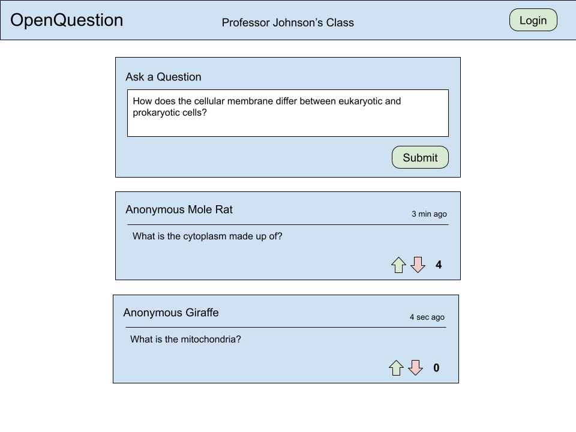

# OpenQuestion: CS260 Startup Application

For course notes, see [notes.md](/notes/notes.md).

## Elevator Pitch

Student/professor interaction is critical to the success of university classes. Professors are meant to be a source of knowledge for their students, but oftentimes students are hesitant to ask questions in front of the class. On the flip side, some students ask irrelevant questions that waste valuable lecture time. OpenQuestion solves this providing a platform to ask questions semi-anonymously that are then vetted before they are presented to the class.

## Key Features

Professors open the app on their computers and create a class, and students are able to submit questions and upvote or downvote the questions posted by other students. Student names are only visible to the professor. The questions are all stored for the professor to view and address later, but if a question reaches a certain vote threshold, it appears on the professor's screen so they can respond to it during the lecture. Every student has a voice, but only the most relevant and common questions come before the class.

## Mockup

## Technologies

 - **HTML** - Basic layout of pages. There will be two HTML pages: one to login and input a class code, and one with the main UI (shown in the mockup above).
 - **CSS** - Simple yet interesting colors and shapes will be used throughout the UI. A simple animation will show when a question is submitted.
 - **JavaScript** - Used for login, submitting and showing questions, voting, and calling endpoints.
 - **React** - The main app UI will be contained in a React page that changes based on user input (user questions and votes) and data received from the server (other users' questions and votes).
 - **Web Service** - Backend service with functions to log in and post a question. Will also call an external API to get anonymous names for users on login (https://metmuseum.github.io/).
 - **Authentication** - The user must log in before posting a question.
 - **Database** - Accounts and credentials are stored in a persistent database. Questions and their related data are stored as well.
 - **Websocket** - Votes are broadcast between users in real time.

 ## React Changelog

- Added interactive login
    - Questions tab and page does not appear until the user is logged in
    - New page displays on the home tab when a user is logged out with an option to see questions and log out
    - Login page triggers a function that will later be used to make an HTTP request for actual login
        - Right now, only localstorage is being used to simulate a login
    - Session info in top right is hidden by default, but displays the user's info on all pages once they log in
 - Added interactive app interface
    - Questions are now rendered dynamically from an array of question data objects
        - Questions are sorted from most to least votes
        - This will eventually be changed to pull the questions from my web service
    - Questions can be added by entering a question into the box and clicking submit
        - New questions get a timestamp that allows the time since post to be displayed in their cards. This information is shown in a human-readable way by calculating the number of seconds, minutes, hours, days, months, or years since post
        - Questions have a unique UUID to allow them to be accessed later
    - Upvotes and downvotes change the number of votes on the question and also trigger the question list to update with the new order